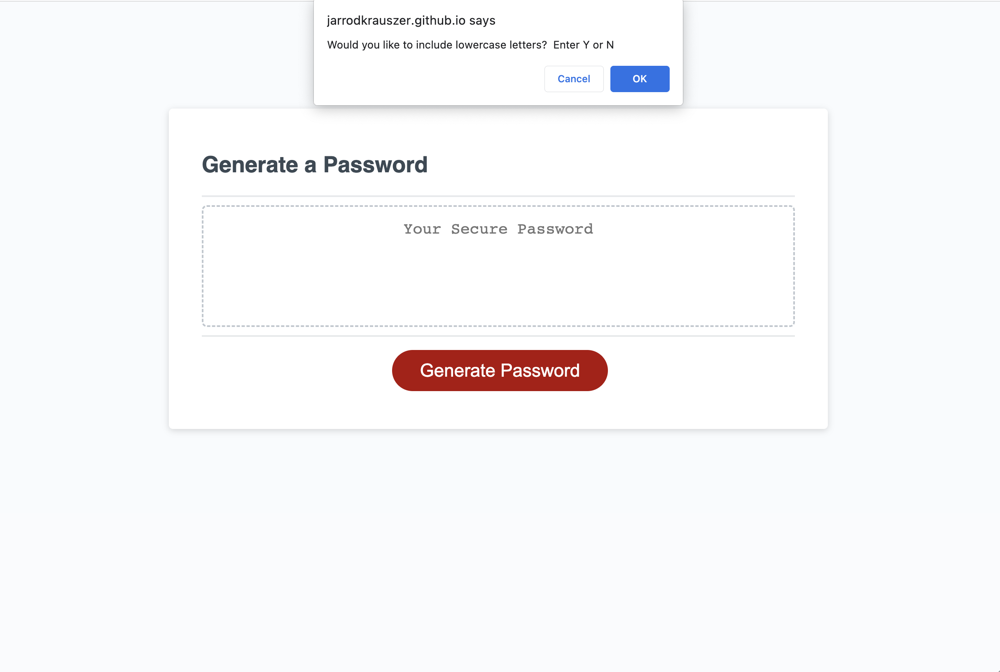

# Password Generator

## Description

In this assignment we were task to create a function to generate a new passwored based on certain criteria.  The user is prompted a series of questions.  They are to select which characters they would like to be included in the password (lowercase, uppercase, numbers and specail characters). Lastly the user is asked to select a password length at least 8 characters long and no more than 128.

## Repository

Link to deployed code:  https://jarrodkrauszer.github.io/password_generator/

## Technologies

 - We used Javascript to complete most of this task
 - We added confirms for each of the character sets they wanted to include
 - We added a prompt to ask the user to enter a password length
 - We used conditionals to see what character sets should be included
 - We created a generatePassword fuction that took in the character set and length are arguments and returns a new password

## Mock-Up

The following image shows the web application's appearance and functionality:

